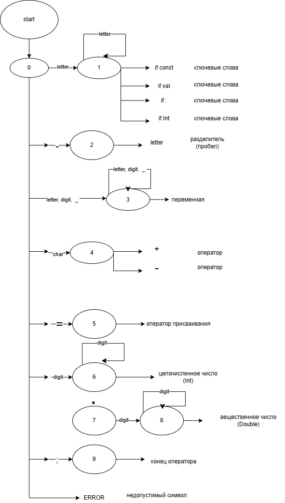

# Руководство пользователя для текстового редактора

## Введение

Данное приложение — текстовый редактор с графическим интерфейсом, разработанный в рамках курсовой работы по дисциплине **"Теория формальных языков и компиляторов"**. Программа позволяет работать с текстом, сохранять файлы, а в будущем планируется дополнение функциями языкового процессора.

---

## Основные функции

### Файл

- **Создать** — создание нового документа.
- **Открыть** — открытие существующего файла.
- **Сохранить** — сохранение текущего документа.
- **Сохранить как** — сохранение документа с указанием нового имени.
- **Выход** — закрытие приложения.

### Правка

- **Отменить** — отмена последнего действия.
- **Повторить** — повтор отмененного действия.
- **Вырезать** — удаление выделенного текста с помещением его в буфер обмена.
- **Копировать** — копирование выделенного текста.
- **Вставить** — вставка текста из буфера обмена.
- **Удалить** — удаление выделенного текста без сохранения в буфере обмена.
- **Выделить всё** — выделение всего текста в редакторе.

### Текст

- Разделение текста по логическим блокам: постановка задачи, грамматика, метод анализа и т. д.

### Панель инструментов

- Быстрый доступ к основным операциям (создание, открытие, сохранение и т. д.) с помощью кнопок.

### Настройки шрифта

- Выбор размера шрифта через выпадающий список.

---

## Как начать работу

1. Запустите приложение.
2. Создайте новый документ или откройте существующий.
3. Внесите изменения в текст.

---

## Заключение

Этот текстовый редактор предоставляет базовые функции для работы с текстом и будет расширяться в будущем для поддержки функций языкового процессора. Если у вас есть вопросы или предложения, пожалуйста, свяжитесь с разработчиком.
## Примеры допустимых строк
const val pi: Double = 3.14;
const val a: Double = 3;
# Диаграмма состояний сканера

# Тестовый пример


# Лабораторная работа: Анализ грамматики объявления констант в Kotlin

## Описание

Этот проект реализует лексер и парсер для анализа грамматики, описывающей объявление вещественных констант в языке Kotlin. Грамматика разработана с использованием **FLEX** и **BISON** и интегрирована в программу для тестирования.

---

## Грамматики

### 1. Исходная грамматика (разработанная)

Исходная грамматика для объявления вещественной константы в Kotlin:

```plaintext
<ConstDeclaration> → const val <Identifier> : <Type> = <Value> ;
<Type> → Double | Float | Int
<Identifier> → [a-zA-Z_][a-zA-Z0-9_]*
<Value> → <FloatNumber>
<FloatNumber> → [0-9]+\.[0-9]+
```
### 2. Грамматика для FLEX и BISON
```plaintext
ConstDeclaration:
    CONST VAL IDENTIFIER COLON Type EQUALS FLOAT_NUMBER SEMICOLON
    ;

Type:
    DOUBLE
    | FLOAT
    | INT
    ;
```
## Классификация грамматики

Грамматика относится к контекстно-свободным грамматикам (КС-грамматикам) по классификации Хомского. Это означает, что:

    Каждое правило имеет вид A → α, где A — нетерминал, а α — строка терминалов и/или нетерминалов.

    Грамматика может быть разобрана с помощью нисходящего или восходящего синтаксического анализа.





# Лаба 6

# Тестовыe примеры
1. Построить РВ для того, чтобы сопоставить все слова, которые
начинаются на букву f или F.
2. Построить РВ для проверки ISBN-13
3. Построить РВ, описывающее время. Формат: ЧЧ:ММ:СС в 24-часовом формате с обязательным ведущим 0


